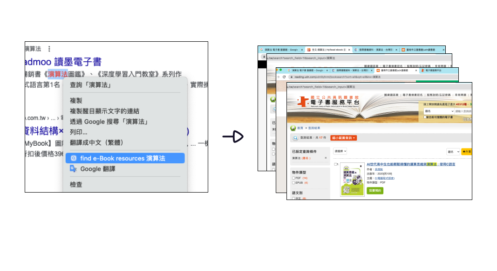
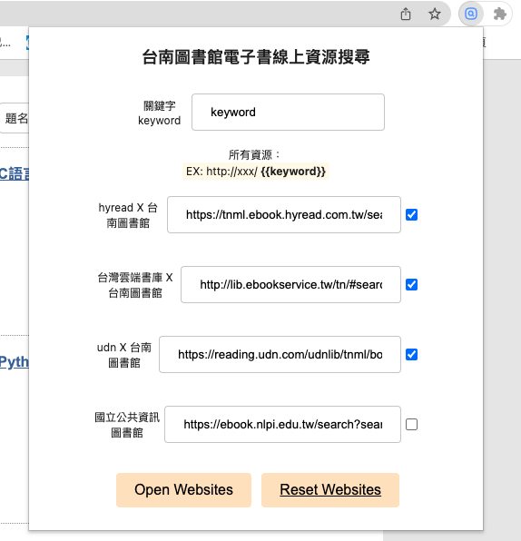

#  Chrome Ext Find-ebook

Chrome Extension for quickly search e-book resources
- 目前預設電子資源網站： HyRead ebook X 台南圖書館/台灣雲端書庫/udn讀書館(臺南分區資源中心)/台灣雲端書庫/國立公共資訊圖書館電子書服務平台

## Features

1. Select a keyword and right-click to quickly open all resources
   - 選取關鍵字右鍵'find e-Book resources'快速一次打開所有資源網站
     
2. click browser toolbar 'find e-book' and input keyword
   - 點擊插件按鈕，輸入關鍵字一次打開所有資源網站
    

---
## package init & develop

This project was bootstrapped with [Chrome Extension CLI](https://github.com/dutiyesh/chrome-extension-cli)

- created by [Chrome Extension Developer Tools](https://marketplace.visualstudio.com/items?itemName=aaravb.chrome-extension-developer-tools) - Chrome Extension: Create New
- quickstart see [quickstart.md](quickstart.md)

## Install

[**Chrome** extension]()

## Contribution

Suggestions and pull requests are welcomed!.

